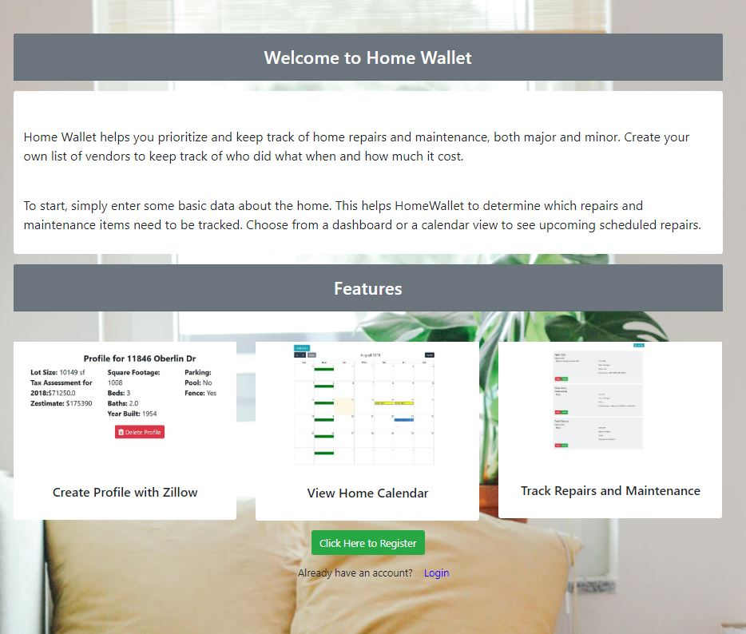

<!-- PROJECT LOGO -->
 

  
  

  

    <a href="https://github.com/dsjuneau/home-wallet"»</strong>View the Repo</a>
     
    <a href="https://home-wallet.herokuapp.com/">View Demo</a>
  	 
    <a href="https://docs.google.com/presentation/d/19XJngLKDLOynOFnbC9sPCDKO_QKhv2dHASfrRRBdOkI/edit?usp=sharing">View Slide Show</a>
  

<!-- TABLE OF CONTENTS -->

## Table of Contents

- [About the Project](#about-the-project)
  - [Built With](#built-with)
- [Getting Started](#getting-started)
  - [Installation](#installation)
- [Screenshots](#screenshots)
- [Upcoming](#upcoming)
- [Contributing](#contributing)
- [Contact](#contact)
  

  <!-- ABOUT THE PROJECT -->

## About The Project

Home Wallet is like CarFax for your Home. It helps you prioritize and keep track of home repairs and maintenance. From the smallest task to a major remodel.

<li>Create your own list of vendors to keep track of who did what, and how much it cost. 
<li>Setup recurring events like mowing the lawn, or one time events like fixing the drain.
<li>Keep all of your documents and photos related to your home in one place

### Built With

|                       NPM Packages and Libraries                       |                  Used in this project                  |
| :--------------------------------------------------------------------: | :----------------------------------------------------: |
|            [BCryptjs](https://www.npmjs.com/package/bcrypt)            | [Nodemailer](https://www.npmjs.com/package/nodemailer) |
| [Password-Generator](https://www.npmjs.com/package/password-generator) |             [React](https://reactjs.org/)              |
|              [Axios](https://www.npmjs.com/package/axios)              |    [Express](https://www.npmjs.com/package/express)    |
|       [FullCalendar](https://www.npmjs.com/package/fullcalendar)       |     [Moment](https://www.npmjs.com/package/moment)     |
|  [Zillow Api](https://www.zillow.com/howto/api/GetSearchResults.htm)   |     [XML2JS](https://www.npmjs.com/package/xml2js)     |
|              [Reactstrap](https://reactstrap.github.io/)               |         [Bootstrap](https://getbootstrap.com/)         |
|            [AWS-SDK](https://www.npmjs.com/package/aws-sdk)            |     [Multer](https://www.npmjs.com/package/multer)     |

### Installation

1. Clone the repo
   <code>
   git clone https://github.com/dsjuneau/home-wallet.git
   </code>
2. Install NPM packages <code>npm i </code> or <code>npm install </code>
3. Get a free ZWSID from Zillow at [https://www.zillow.com/webservice/Registration.htm](https://www.zillow.com/webservice/Registration.htm)
4. You will also need to create an Amazon AWS Account at [https://aws.amazon.com/premiumsupport/knowledge-center/create-and-activate-aws-account](https://aws.amazon.com/premiumsupport/knowledge-center/create-and-activate-aws-account/) and then set up an S3 bucket to hold Documents.
5. Create a <code>.env</code> file to hold all private keys.

<!-- Screenshots -->

## Screenshots

### Calendar

### Repairs

### Vendors

### Documents

<!-- UPCOMING -->

## Upcoming

Features for the future include :

<li>Fully Mobile</li>
<li>Multiple properties  (investors, vacation home, etc… )
</li>
  <li>Print a summary of Repairs etc</li>
  <li>Share your profile with RE professionals</li>
  <li>Integration with Google Calendar and Drive</li>
<li>How-To videos and instructions when you don’t need a Vendor
</li>
<li>Get recommendations for Vendors and Repairs from friends or other services</li>

<!-- CONTRIBUTING -->

## Contributing

[Michael Gentilini](https://github.com/MichaelGentilini)   [Scott Juneau](https://github.com/dsjuneau/home-wallet)
 
[Megan Moser](https://github.com/mgmoser1)

<!-- CONTACT -->

## Contact

Project Link: [https://github.com/dsjuneau/home-wallet](https://github.com/dsjuneau/home-wallet)
